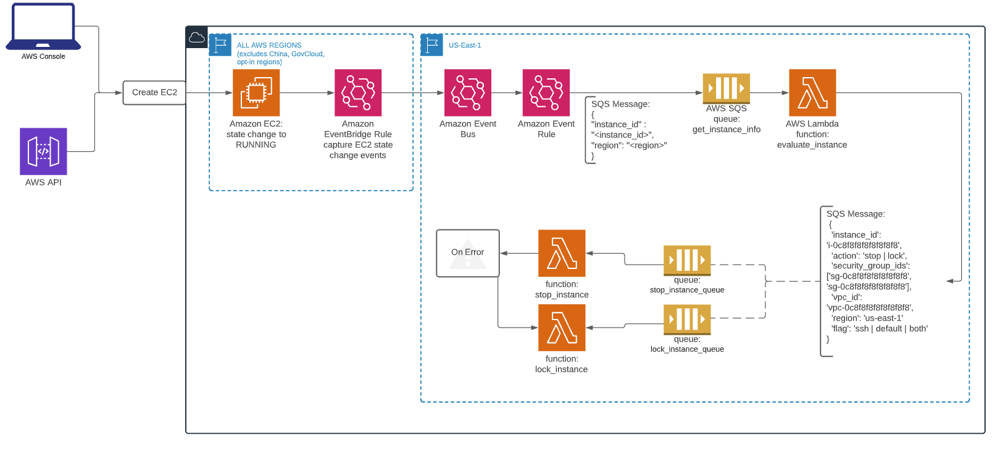

# Auth0 Challenge Service

This repository is for the Auth0 Candidate challenge. The requirement is to set-up dynamic security controls for EC2 instances. This service should:

- Shutdown a newly launched EC2 instance that uses a VPC’s default security group 
- Shutdown a newly launched EC2 instance that has SSH open to the world

## Github Setup

This Github will contain code for the Auth0 Challenge Service. We use branch protection rules to prevent merging unless all steps of a checklist are in place.

The repository has the following directories:

terraform/challengeservice/

- To be used for the terraform code for the Auth0 Challenge Service

terraform/challengetest/

- To be used for the terraform code to test the Auth0 Challenge Service

terraform/challengetest/trusted/

- Security Team is CODEOWNERS for this directory
- This is a trusted directory, so we will not be running policy agents in this directory.

terraform/challengetest/untrusted/

- Engineering Team is CODEOWNERS for this directory
- This is an untrusted directory, so we will be running a policy agent in this directory to check for security violations

### Terraform Setup

We are using Terraform Cloud's Free Tier as a remote backend for running our terraform code. Github Actions will run, connect to Terraform Cloud, and publish results to the branch before merging. To initialize Terraform Cloud, ensure your TFC user has been invited to the "Ursys" Organization, and then execute `terraform login`. This will generate a User API token, which can then be used to authorize terraform CLI commands against the TFC Backend.

### Github Actions

We use Github Actions to automate running tests and deploying our Terraform code.

## Project Architecture

The Auth0 Challenge Service is made up of the following components:

### AWS EventBridge

AWS Eventbridge is a severless event bus. We use a rule to create an event when an EC2 instance changes its state to running. That event is then sent to a Lambda Function.

#### Sample Event Pattern

```json
{
  "version": "0",
  "id": "ee376907-2647-4179-9203-343cfb3017a4",
  "detail-type": "EC2 Instance State-change Notification",
  "source": "aws.ec2",
  "account": "123456789012",
  "time": "2015-11-11T21:30:34Z",
  "region": "us-east-1",
  "resources": ["arn:aws:ec2:us-east-1:123456789012:instance/i-abcd1111"],
  "detail": {
    "instance-id": "i-abcd1111",
    "state": "running"
  }
}
```

### AWS Lambda

We use a number of AWS Lambda functions to handle the following:

- Handle state change events from EventBridge and get the instance ID
- Get the instance details from EC2 (Instance Type, OS Type, Storage Volume Type, Deletion Prevention, ENI IDs, Security Groups, Security Group Rules, and Tags)
- Analyze the instance details, determine if the instance is a candidate for stopping, termination, or locking, and send to the corresponding SQS Queue.
- Stop, Terminate, or Lock the instance

### AWS SQS

We use AWS SQS to handle unexpectedly high throughput, and to ensure that in the event of a situation where Lambda cannot process an event, we do not lose the event, which would be the case if were relying solely on AWS SNS. AWS SQS Supports both queueing and batching of requests sent to Lambda functions.

## AWS Architecture


